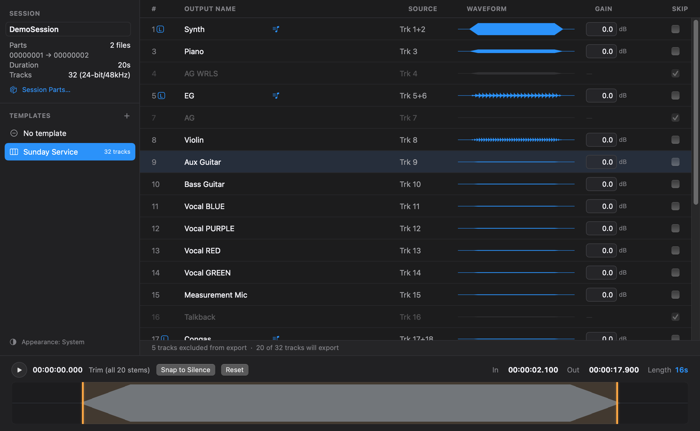

# Stem Exporter

**A folder of multitrack WAVs in. A folder of named, trimmed stems out.**

> ⚠️ **Warning:** This project is vibe coded (built largely with AI assistance)
> and may be buggy. Use at your own risk, and back up your source recordings
> before exporting. I am a software engineer but do not have a ton of experience
> with Swift or native macOS apps

Every week the multitrack comes off a Behringer Wing Live's SD card as a
handful of anonymous 32-channel files. Getting usable stems out of it means
importing the lot into a DAW, naming every channel by hand, topping and tailing
the recording, and bouncing each track individually — ten to fifteen minutes of
clicking, and the same ten to fifteen minutes next week.

It's built around the Wing Live's multitrack format, but works the same way with
any recorder that writes sample-synced, multichannel WAVs — field recorders
included.

Stem Exporter is that chore as a native macOS app. Point it at the folder, pick
your template, set the trim, press Export.



## What it does

**Names every channel for you.** A template is the saved answer to "what's
plugged into each input?" — names, stereo pairings, default gains, unused inputs.
Build it once for your rig; every session after that opens pre-named. Templates
are plain JSON, so moving one to another Mac is a file copy.

**Trims once, for everything.** All tracks are sample-synced on the same clock,
so there's one In point and one Out point. Drag the handles, type timecode, or
press Snap to Silence to cut the dead air at both ends automatically. `Space`
auditions so you can find the downbeat by ear.

**Catches clipping before you export, not after.** Push a track's gain and its
waveform redraws its clipped regions in red as you drag. The export summary is
the final check, counting real clipped samples from the render itself.

**Skips the inputs you never used.** Patched-but-silent channels arrive with
Skip already ticked and the row marked "empty" — one click puts them all back if
you disagree.

**Handles the whole recording, however long.** Multi-part recordings are
concatenated into one session automatically. Files past 4 GB are fine — the
writer promotes itself to RF64. A 12 GB session imports in seconds, because
waveform analysis is a preview pass rather than a full decode.

**Exports in one pass.** The source is read once and de-interleaved into every
stem at the same time, so memory stays flat and every file finishes together
rather than queueing up one at a time.

**Changes nothing it wasn't asked to.** No resampling, no format conversion, no
mixing. Stems come out as WAV (BWF) at the source's own bit depth and sample
rate, carrying metadata that points back at the session. The only processing is
your gain and your trim.

## Get it

Needs macOS 14 (Sonoma) or later.

Grab the latest build from
[Releases](https://github.com/NPBibleChurch/stem-exporter/releases), unzip it and
drag it to Applications. The build is ad-hoc signed rather than notarised, so the
first launch needs a right-click → **Open** (or System Settings → Privacy &
Security → **Open Anyway**) to get past Gatekeeper.

Or build it yourself:

```bash
./Scripts/build-app.sh release
open build/StemExporter.app
```

No recorder handy? `swift Scripts/make-demo-session.swift ~/Desktop/DemoSession`
writes a synthetic 32-channel session to try it on.

## Documentation

- **[User guide](docs/USER-GUIDE.md)** — how to use it, screen by screen, with
  screenshots.
- **[Development guide](docs/DEVELOPMENT.md)** — building, testing, architecture
  and releasing.
- **[SPEC.md](SPEC.md)** — what it was built to do.
