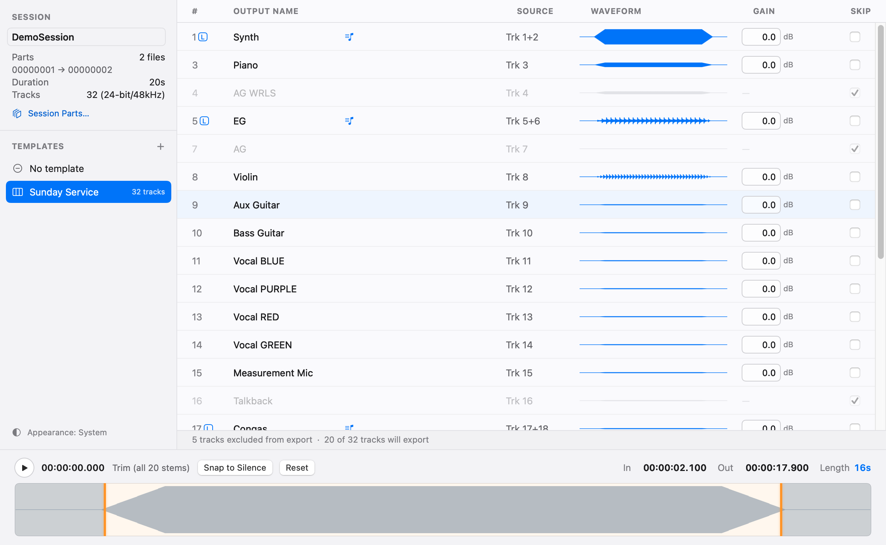
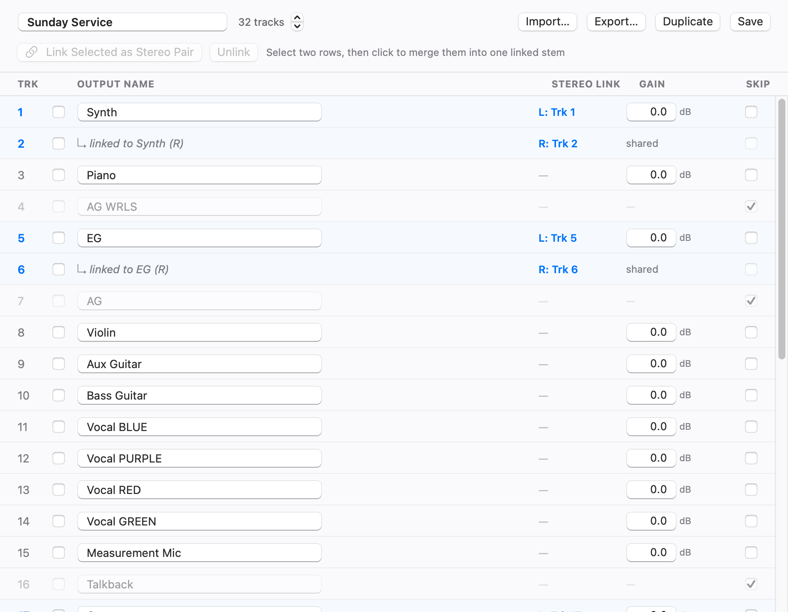
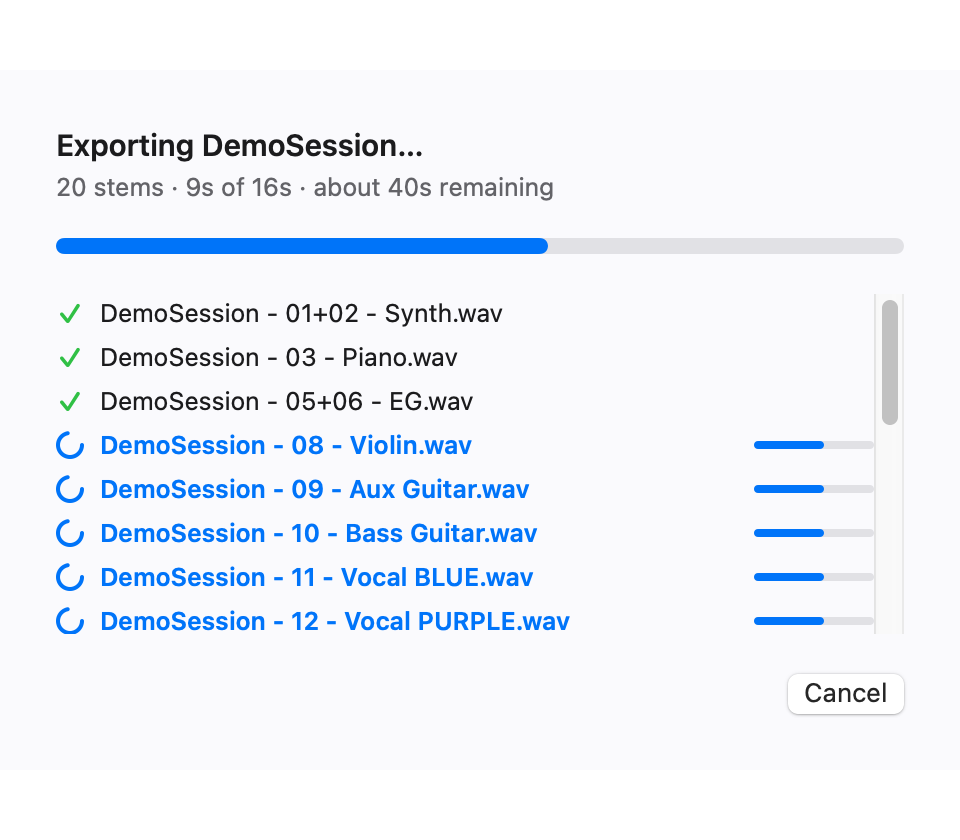
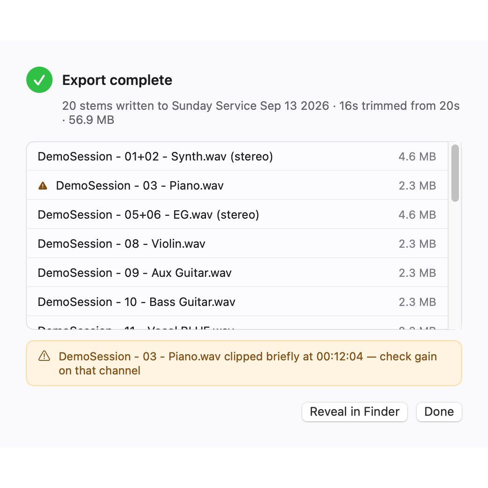
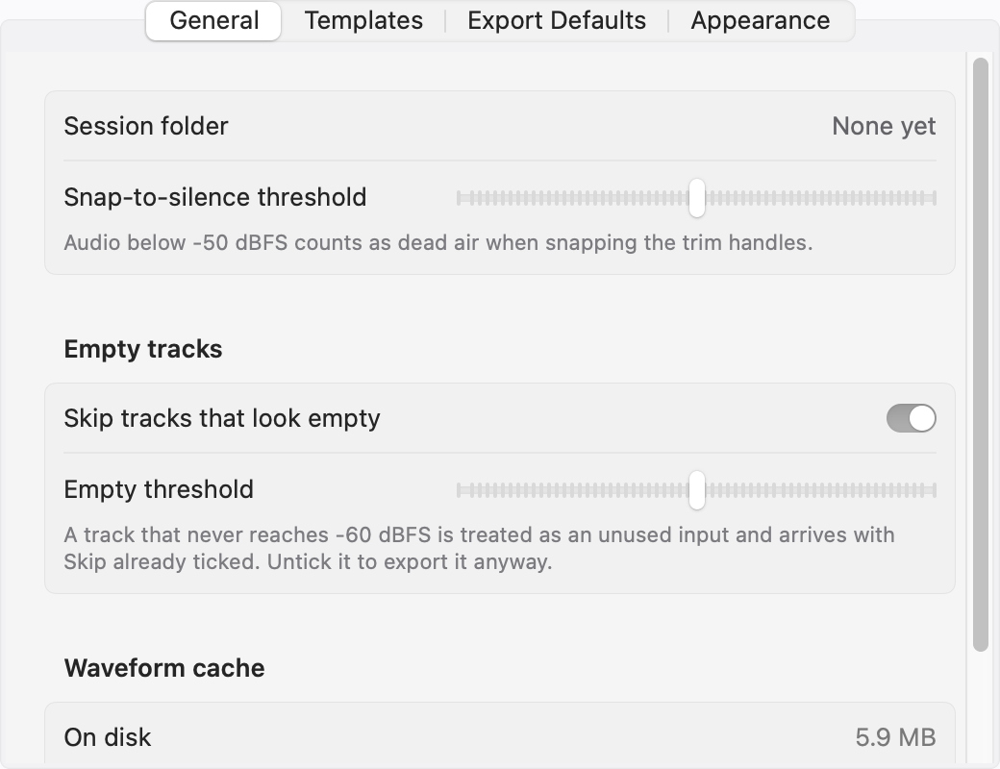

# Stem Exporter — User Guide

Stem Exporter turns a folder of multichannel field-recorder WAVs into a folder of
named, trimmed, per-track stems. The job it replaces is the weekly DAW chore:
import the multitrack, name 32 channels, top and tail the recording, bounce each
track out. Here it's a couple of clicks.

> ⚠️ This project is vibe coded (built largely with AI assistance) and may be
> buggy. Back up your source recordings before exporting.

**Contents**

1. [Before you start](#1-before-you-start)
2. [Quick start](#2-quick-start)
3. [The main window](#3-the-main-window)
4. [Loading a session](#4-loading-a-session)
5. [Templates](#5-templates)
6. [Trimming the session](#6-trimming-the-session)
7. [Gain and clipping](#7-gain-and-clipping)
8. [Skipping tracks](#8-skipping-tracks)
9. [Exporting](#9-exporting)
10. [Settings](#10-settings)
11. [Keyboard reference](#11-keyboard-reference)
12. [Where things are stored](#12-where-things-are-stored)
13. [Troubleshooting](#13-troubleshooting)

---

## 1. Before you start

**You need**

- macOS 14 (Sonoma) or later.
- A session folder: one or more WAV/BWF files from a multichannel recorder, all
  with the same channel count, sample rate and bit depth. Recorders typically
  split a long recording into several numbered parts (`00000001.WAV`,
  `00000002.WAV`, …) — Stem Exporter treats those as one continuous session.

**What it does not do.** There's no resampling, no format conversion and no
mixing. Stems come out as WAV (BWF) at the source's own bit depth and sample
rate. The only processing applied is your per-track gain and the trim.

**No recorder handy?** Generate a synthetic 32-channel session to try it on:

```bash
swift Scripts/make-demo-session.swift ~/Desktop/DemoSession
```

That's the session shown in the screenshots throughout this guide.

---

## 2. Quick start

1. **Add the session.** Drag the recorder's folder onto the window, or press
   `⌘O`. The app reads the WAV headers, concatenates the parts in order, and
   analyses waveforms in the background (a few seconds even for a 12 GB session).
2. **Pick a template** from the toolbar's Template menu. That names every track —
   "Piano", "Vocal RED" — instead of "Track 1", "Track 2". The first time
   through, build one; after that it's one click each week.
3. **Set the trim.** Click **Snap to Silence** to cut the dead air at each end, or
   drag the In/Out handles in the bar at the bottom. Press `Space` to audition.
4. **Check the levels.** Any track whose gain would clip turns red as you type.
5. **Press Export All.** Choose a destination folder; every included stem is
   written in a single pass.

---

## 3. The main window



*Shown with a 32-channel demo session loaded and the "Sunday Service" template
applied. A dark-mode version of every screenshot in this guide sits alongside it
in `docs/screenshots/` with a `-dark` suffix.*

The window is three regions:

**The sidebar (left)** carries the session's identity and your templates. The
name field at the top is what goes into every exported filename — edit it and the
stems are renamed to match; clear it to fall back to the folder name. Below it,
**Parts**, **Duration** and **Tracks** report what was actually read out of the
files, and **Session Parts…** opens a sheet listing each file. The **Appearance**
line at the bottom of the sidebar reports the current Light / Dark / System
setting; change it in **Settings › Appearance**.

**The track table (centre)** is one row per track, in input order:

| Column | What it does |
|---|---|
| **#** | The source track number. An `L` badge marks the left side of a stereo pair. |
| **Output name** | The exported filename's name part. Click to edit it for this session only. |
| **Source** | Which input channel(s) the stem is pulled from — `Trk 3`, or `Trk 5+6` for a pair. |
| **Waveform** | The track's envelope, redrawn live as you change its gain. Clipped regions show in red. |
| **Gain** | Level trim in dB, applied on export. |
| **Skip** | Ticked means the track is not exported. |

The footer under the table keeps a running count — "5 tracks excluded from export
· 20 of 32 tracks will export" — so the export size is never a surprise.

**The trim bar (bottom)** holds transport and one In/Out selection for the whole
session. See [Trimming](#6-trimming-the-session).

**The toolbar** (the window's title bar, above the area captured in the
screenshot) has three controls: **+** to add a session folder, the **Template**
menu, and the **Export All (n)…** button, which counts the stems it's about to
write. If Export is greyed out, hover it — the tooltip says why (no session,
everything excluded, or an empty trim selection).

---

## 4. Loading a session

Three ways in, all equivalent:

- Press `⌘O` (**File › Add Session Folder…**) and pick the folder.
- Drag the folder onto the window.
- Drag the folder onto the app icon in the Dock.

Point it at the **folder**, not at an individual WAV. The app finds the files
inside, sorts them by name, checks that their formats agree, and concatenates
them into one virtual timeline. Track count is read from the file — nothing is
assumed about it.

**Session Parts…** in the sidebar opens the list of files that make up the
session, each with its duration, channel count and format:

- **Drag to reorder** if your recorder's filenames don't sort the way it wrote
  them.
- **Untick a part** to leave it out of the session entirely — useful when a
  soundcheck got recorded as part 1.

Either change re-analyses the waveforms.

**Renaming.** The session name field in the sidebar feeds the `{session}` token
in every exported filename. It defaults to the folder name; the revert button
next to it puts that back.

---

## 5. Templates

A template is the saved answer to "what is plugged into each input?" — names,
stereo pairings, default gains and which inputs are unused. Build one for your
rig and every future session opens pre-named.

Templates live in the sidebar and in the toolbar's Template menu. When you load
a session, if a template's track count matches the session's, it's selected
automatically.

### The template editor

Open it from **Template › Edit Template…** in the toolbar, from the sidebar's
context menu, or from **Settings › Templates**.



- **Name** and **track count** are at the top. The count should match your
  recorder's channel count.
- **Output name** — what each track is called. A greyed name with **Skip** ticked
  is an input you've marked as unused.
- **Stereo link** — tick the checkboxes on two rows, then click **Link Selected
  as Stereo Pair**. They merge into one stem: the upper row keeps the name, the
  lower shows `↳ linked to … (R)` and shares the pair's gain. **Unlink** splits
  them back into two mono stems.
- **Gain** — the default level trim for that track, carried into every session
  that uses this template.
- **Skip** — inputs that should never be exported.

**Import…** and **Export…** read and write the same plain-JSON file format the
app stores templates in, so moving a template to another Mac is a file copy.
**Duplicate** is the quickest way to make a variant. **Save** writes the
template; the editor is a separate window, so you can leave it open beside the
main one.

### Per-session changes

Editing a name, gain or skip box **in the main window** changes that session
only — the template is untouched. When you've made such changes, a **Save Changes
to Template** button appears in the table footer to push them back into the
template if you want them to stick.

---

## 6. Trimming the session

Every track is sample-synced on the same clock, so there is one In point and one
Out point for the whole session, not one per track. The bar at the bottom shows a
mono summary of the session; the shaded regions at either end are what gets cut.

**Setting the points**

- **Drag the In or Out handle.** The handles own a narrow band around
  themselves — the cursor changes to a left/right arrow when you're close enough
  to grab one.
- **Click anywhere else in the bar** to drop the playhead there and audition from
  that point. This is why clicking in the middle of the waveform doesn't yank a
  trim handle across the session.
- **Press `I` / `O`** to set In or Out at the current playhead.
- **Type into the In / Out fields** on the right of the trim bar for exact
  timecode.
- **Snap to Silence** (`⇧⌘S`) nudges In forward and Out backward to the nearest
  real sound. The threshold for what counts as silence is in
  **Settings › General**, default −50 dBFS.
- **Reset** restores the full session.

**Listening.** `Space` plays and pauses from the playhead. Playback is a mono
downmix streamed off the source — not 32 live channels — which is all you need to
find the downbeat. `←` and `→` nudge the playhead: a second at a time on their
own, 10 seconds with `⇧`, a tenth of a second with `⌥`. `Home` and `End` jump the
playhead to the In and Out points.

**Length** at the right of the trim bar shows what you're about to export. It
turns red if the selection is empty, which also blocks Export.

---

## 7. Gain and clipping

The **Gain** field applies a level trim on export. Two ways to set it:

- Type a value.
- **Drag vertically in the field** — the waveform in that row redraws as you
  move, which is the point of putting the control there.

Peaks are cached at unity gain, so changing a track's dB rescales the cached
envelope instantly. No re-analysis, no waiting.

**Clipping is surfaced before you export.** If a level would push the track past
full scale, the field's border and text turn red and the `dB` label changes to
`clip`; the clipped regions of the waveform turn red too. Hover the `clip` label
and the tooltip tells you how much headroom unity actually leaves — e.g. "This
level clips. Unity leaves 2.4 dB of headroom."

The export summary is the final check: it counts real clipped samples from the
render itself and names the file and timestamp.

---

## 8. Skipping tracks

Tick **Skip** on any row to leave it out of the export. Skipped rows grey out and
their gain field is disabled.

**Empty inputs arrive already skipped.** During import, any track whose loudest
sample never reaches −60 dBFS is flagged as a patched-but-unused channel: its
Skip box is ticked and the row is badged "empty". A stereo pair needs both sides
empty before it counts.

This is a starting point, not a decision:

- Untick a row and it stays unticked.
- **Include Them** in the table footer puts all the auto-skipped tracks back at
  once.
- The whole behaviour and its threshold live in **Settings › General** — turn
  **Skip tracks that look empty** off if you'd rather decide yourself.

---

## 9. Exporting

Press **Export All** in the toolbar, or `⌘E`.

You're asked where to write **at the moment you export**, not beforehand — so the
choice is made with the session in front of you. The panel opens at the last
folder you used, which makes a run of exports to the same place one extra
keystroke.

### Progress



Notice that every stem advances together rather than a queue working down one
file at a time. That's the architecture being honest: the source is read exactly
once, in blocks, and every output channel is de-interleaved out of the same
block. A 32-channel session is not read 32 times, and memory stays flat however
long the recording is.

**Cancel** stops the render and cleans up after itself — every partial file is
removed, so a cancelled export leaves nothing behind.

### Summary



When it finishes you get the full list: every stem, its size, whether it's
stereo, and a warning triangle on anything that clipped — with the timestamp of
the first clipped sample, so you know where to look. **Reveal in Finder** opens
the output folder.

### Filenames

The default pattern is `<Session> - <NN> - <Name>.wav`, giving
`DemoSession - 03 - Piano.wav`. Track numbers are zero-padded so Finder sorts the
stems in input order, and a stereo pair uses both numbers:
`DemoSession - 01+02 - Synth.wav`. The pattern is editable in
**Settings › Export Defaults**.

### If files already exist

You're asked once per export, not once per file, and told which files would be
replaced:

- **Replace** overwrites them.
- **Keep Both** adds a numeric suffix to the new files.
- **Cancel** stops.

Set a permanent answer in **Settings › Export Defaults › If a file already
exists**.

---

## 10. Settings

`⌘,` opens Settings, which has four tabs.



**General**

- **Snap-to-silence threshold** — what counts as dead air when snapping the trim
  handles. Default −50 dBFS.
- **Skip tracks that look empty** and **Empty threshold** — the auto-skip
  behaviour from [section 8](#8-skipping-tracks). Default −60 dBFS.
- **Waveform cache** — how much the analysis cache is using, and a **Clear Cache**
  button. The cache is keyed on each part's path, size and modification date, so
  re-opening a folder is instant and a changed folder is re-analysed.

**Templates** — the full list, with Edit / Duplicate / Delete per template, plus
**New Template…**, **Import…** and **Show in Finder**.

**Export Defaults**

- **File naming** — the pattern, with the tokens `{session}`, `{track}` and
  `{name}`, and a live example underneath.
- **Create a dated subfolder for each export** — off by default.
- **If a file already exists** — Ask / Replace / Keep Both.
- **Format** — informational: output is always WAV (BWF) at the source's own bit
  depth and sample rate, with BWF metadata pointing back at the session.

**Appearance** — Light, Dark or System, with both themes previewed side by side.
System follows macOS's own setting; Light and Dark force the app's appearance
regardless of macOS.

---

## 11. Keyboard reference

| Shortcut | Action |
|---|---|
| `⌘O` | Add session folder |
| `⌘E` | Export all |
| `⌘,` | Settings |
| `Space` | Play / pause |
| `I` | Mark In at playhead |
| `O` | Mark Out at playhead |
| `⇧⌘S` | Snap to silence |
| `←` / `→` | Nudge playhead 1 second |
| `⇧←` / `⇧→` | Nudge playhead 10 seconds |
| `⌥←` / `⌥→` | Nudge playhead 0.1 seconds |
| `Home` | Playhead to In point |
| `End` | Playhead to Out point |

`Home` and `End` are in the **Playback** menu rather than bound invisibly,
because unlike `Space` and the arrows they can't be typed into a name or
timecode field.

---

## 12. Where things are stored

| What | Where |
|---|---|
| Templates | `~/Library/Application Support/Stem Exporter/Templates` — one JSON file each |
| Waveform cache | `~/Library/Caches` — safe to delete; it rebuilds |
| Preferences | Standard macOS preferences for the app's bundle identifier |

Templates being plain JSON is deliberate: backing one up, diffing it or moving it
to another Mac is a file copy. It's the same format Import/Export in the editor
reads and writes.

---

## 13. Troubleshooting

**"The app says my files don't match."** Every part in a session folder must
share a channel count, sample rate and bit depth. A soundcheck recorded at a
different rate, or a stray WAV from another session, will stop the load — use
**Session Parts…** to untick it, or move it out of the folder.

**The parts are in the wrong order.** Open **Session Parts…** and drag them.
Files are concatenated top to bottom.

**My template has the wrong number of tracks.** It still opens the session.
Template slots pointing past the last channel are dropped with a message, and any
channel the template doesn't cover falls back to "Track N".

**Export is greyed out.** Hover it for the reason: no session loaded, every track
excluded, or the trim selection is empty.

**macOS keeps asking for permission to a folder.** The app is unsandboxed by
design — it needs to reach NAS mounts and arbitrary folders — but macOS still
gates Desktop, Documents, Downloads and some network volumes behind TCC. The app
keeps security-scoped bookmarks for the session and destination folders so it
shouldn't re-prompt each launch. If it does, re-pick the folder once through the
panel rather than dragging it in.

**A stem clipped and I didn't notice.** The summary reports it after the fact,
but the live check is the gain field turning red while you edit. If a track is
hot at unity, the `clip` tooltip tells you exactly how much headroom you have.
